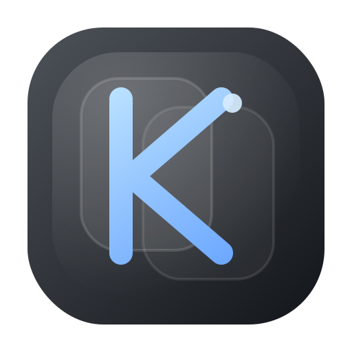

# KClip

<p align="center">
  
</p>

KClip is a fast macOS menu bar clipboard history app focused on speed, polished motion, and local-only clipboard storage.

## What It Does

- Keeps a searchable clipboard history in the menu bar.
- Stores text and image clips locally in Application Support.
- Auto-tags copied screenshots, photos, and image files as `Image`.
- Auto-tags standalone hex color palettes as `Color`, with swatch previews and palette editing.
- Supports tag filtering, pinning, preview, edit, delete, and reorder.
- Pastes text or images directly back into the previous app after selection.
- Exports dragged clips as plain text or `.txt` files, and image clips as `.png` files.

## Install From A Release

1. Download the latest `KClip-v*-macOS.zip` from Releases.
2. Unzip it.
3. Move `KClip.app` to `/Applications` or `~/Applications`.
4. Launch KClip and enable Accessibility when prompted.

## Build From Source

```bash
swift test
./script/build_and_run.sh run
```

For a packaged archive:

```bash
./script/make_release.sh v0.1.8
```

## Requirements

- macOS 15 or later
- Swift 6.1 toolchain
- GitHub Actions uses `macos-15`

## Permissions

KClip needs Accessibility access to send paste events back to the previously focused app. Clipboard history itself stays local.

## Release Workflow

- CI runs `swift test` and a release-bundle smoke build on GitHub.
- Tagging `v*` triggers the release workflow and attaches the packaged zip.
- The local release script produces the same artifact shape used for manual releases.

## Project Notes

- Source files are intentionally kept small; the working rule is no Swift file over 120 lines.
- Build products and internal agent planning files are excluded from version control.

## Contributing And License

- Contribution guide: [CONTRIBUTING.md](CONTRIBUTING.md)
- Changelog: [CHANGELOG.md](CHANGELOG.md)
- License: [MIT](LICENSE)
